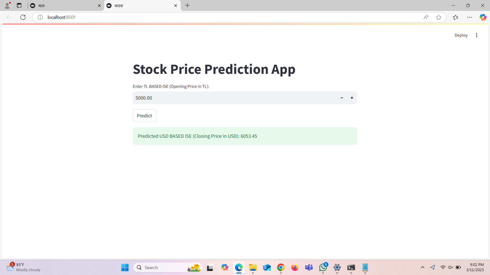

# Stock Price Prediction App

A web application built with Streamlit that predicts USD-based ISE (Istanbul Stock Exchange) closing prices based on TL (Turkish Lira) opening prices.

## Overview

This application leverages a machine learning model to predict stock prices. Users can input the TL-based ISE opening price, and the application will predict the corresponding USD-based ISE closing price.

## Features

- Simple and intuitive user interface
- Real-time price predictions
- Interactive number input with decimal precision

## Screenshot



## Prerequisites

Before running this application, make sure you have the following:

- Python 3.7+
- Required Python packages (see requirements.txt)
- Trained model file:
  - `stock_price_model.pkl` (The trained prediction model)

## Installation

1. Clone this repository or download the source code:
   ```
   git clone <repository-url>
   ```

2. Install the required packages:
   ```
   pip install -r requirements.txt
   ```

## Usage

1. Ensure the model file (`stock_price_model.pkl`) is in the same directory as the application.

2. Run the Streamlit application:
   ```
   streamlit run app.py
   ```

3. Open your web browser and navigate to the local URL provided by Streamlit (typically http://localhost:8501).

4. Enter a TL-based ISE opening price and click "Predict" to see the predicted USD-based ISE closing price.

## How It Works

1. The application loads a pre-trained machine learning model.
2. When a user inputs a TL-based ISE opening price:
   - The input is converted to a numpy array format suitable for the model
   - The model predicts the corresponding USD-based ISE closing price
   - The prediction is displayed to the user

## Project Structure

```
├── app.py                  # Main Streamlit application
├── stock_price_model.pkl   # Trained prediction model
├── requirements.txt        # Required Python packages
├── README.md               # This file
└── outputs/                # Folder containing screenshots
    └── output.png          # Application screenshot
```

## Requirements

- streamlit
- scikit-learn
- numpy
- joblib

## Model Information

The application uses a machine learning model trained on historical stock price data from the Istanbul Stock Exchange. The model is designed to predict USD-based closing prices based on TL-based opening prices.

## Future Improvements

- Add visualizations of historical price trends
- Implement multiple input features for more accurate predictions
- Add confidence intervals for predictions
- Include options for different prediction timeframes
